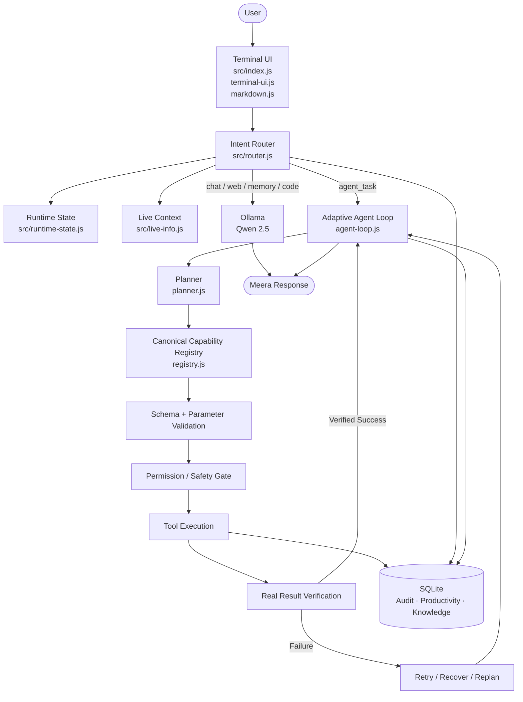
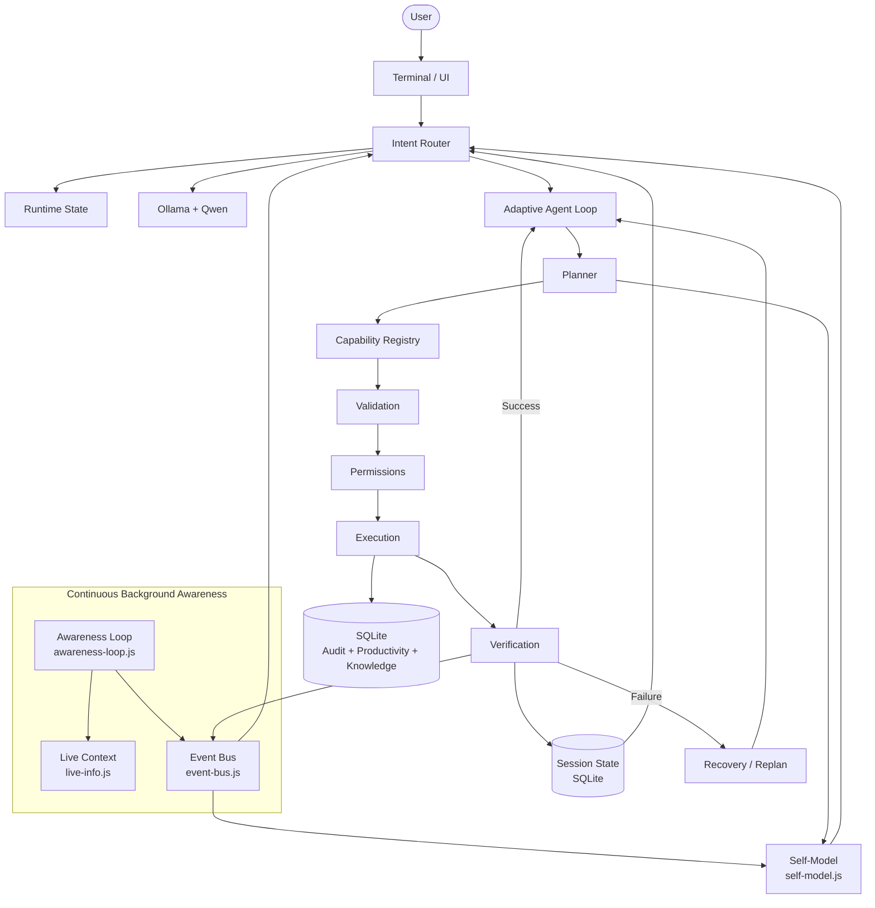
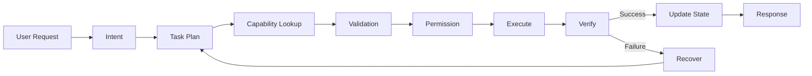

# ⟡ Meera

### **A local-first AI orchestration layer built to understand, plan, execute, verify, and evolve.**

<p align="center">

**Ollama + Qwen 2.5** · **SearXNG** · **Windows Automation** · **Verified Tool Execution**

</p>

<p align="center">

[](https://opensource.org/licenses/MIT)
[](https://nodejs.org/)
[](https://ollama.com/)
[](#tool-ecosystem)
[](#project-status)

</p>

> **Meera is not a chatbot wrapper.**
>
> It is a local AI orchestration layer that routes intent, selects capabilities, executes real actions, verifies what actually happened, and maintains an evolving operational model of its environment.

---

## ✦ What Is Meera?

Meera started as a local terminal interface around **Ollama + Qwen 2.5**.

It is now evolving into a broader **AI operating layer** for the local machine.

```text
┌─────────────────────────────────────────────────────────────┐
│                         MEERA                               │
│                                                             │
│  Understand → Route → Plan → Validate → Act → Verify       │
│                         ↓                                   │
│                   Update State                              │
│                         ↓                                   │
│                  Continue / Stop                            │
└─────────────────────────────────────────────────────────────┘
```

Meera is designed around one non-negotiable rule:

> **Planner output is never proof of execution.**

A model saying:

```text
"Chrome was opened."
```

does not make it true.

Meera requires:

```text
PLAN
 ↓
VALIDATE
 ↓
PERMISSION
 ↓
EXECUTE
 ↓
VERIFY
 ↓
SUCCESS
```

Only a **real executed and verified result** is considered successful.

---

# 🧠 Operational Self-Awareness

Meera's current and planned self-awareness is **operational**, not a claim of sentience.

It means Meera can maintain accurate knowledge of things such as:

```text
┌──────────────────── SELF MODEL ────────────────────┐
│ Identity                                           │
│ Active model                                       │
│ Available capabilities                             │
│ Service health                                     │
│ Tool reliability                                   │
│ Current task                                       │
│ Last action                                        │
│ Last verified result                               │
│ Current limitations                                │
└────────────────────────────────────────────────────┘
```

The next architectural evolution adds:

* continuous environment observation
* persistent session/task state
* event-driven state propagation
* rolling tool reliability
* resumable tasks
* stronger contextual continuity

---

# 🏗️ Architecture

## Current Execution Architecture



---

## Persistent-Agent Architecture

The long-term architecture wraps the current verified execution system with persistent state and continuous awareness.



### The intended state cycle

```text
OBSERVE
   ↓
UPDATE STATE
   ↓
UNDERSTAND
   ↓
PLAN
   ↓
VALIDATE
   ↓
PERMISSION
   ↓
ACT
   ↓
VERIFY
   ↓
UPDATE STATE
   ↓
CONTINUE / COMPLETE
```

---

# ⚡ Core Execution Pipeline



### Reliability guarantee

```text
Planner output
      ≠
Execution evidence

Execution
      +
Verification
      =
REAL SUCCESS
```

---

# 🧩 Core Modules

| Module                     | Responsibility                                |
| -------------------------- | --------------------------------------------- |
| `src/index.js`             | Application entry point                       |
| `src/terminal-ui.js`       | Terminal interface and interaction lifecycle  |
| `src/markdown.js`          | Markdown and code rendering                   |
| `src/router.js`            | Intent routing and local-first decisions      |
| `src/runtime-state.js`     | Runtime state and capability awareness        |
| `src/live-info.js`         | Live system/environment information           |
| `src/tools/registry.js`    | Canonical capability registry                 |
| `src/tools/planner.js`     | Next-action planning                          |
| `src/tools/agent-loop.js`  | Multi-step execution and recovery             |
| `src/tools/executor.js`    | Tool execution orchestration                  |
| `src/tools/permissions.js` | Permission and safety gates                   |
| `src/awareness-loop.js`    | Continuous environment observation            |
| `src/event-bus.js`         | Cross-module state/event propagation          |
| `src/session-state.js`     | Persistent task/session state                 |
| `src/self-model.js`        | Operational self-model and reliability trends |
| `src/db.js`                | SQLite persistence and audit data             |

---

# 🛠️ Tool Ecosystem

### **64 registered capabilities**

### **56 currently available**

Availability depends on installed dependencies, configuration, and credentials.

```text
┌──────────────────────────────────────────────────────────────┐
│                    MEERA CAPABILITY LAYER                     │
├──────────────────────────────────────────────────────────────┤
│                                                              │
│  SYSTEM        APPS          BROWSER        FILES            │
│  CPU           Launch        Navigate       Read             │
│  GPU           Focus         Click          Write            │
│  RAM           Close         Type           Search           │
│  Battery       Discover      Forms          Move             │
│  Audio         Windows       Tabs           Copy             │
│  Clipboard                   Extraction      Archive         │
│                                                              │
│  NETWORK       EXECUTION     UI AUTOMATION  MEDIA            │
│  Wi-Fi         PowerShell    pywinauto       Spotify         │
│  DNS           Python        PyAutoGUI       PDF             │
│  Ping          Git           Mouse           Audio           │
│  Bluetooth                   Keyboard                        │
│                                                              │
│  PRODUCTIVITY                  INTEGRATIONS                  │
│  Tasks                         Playwright                     │
│  Reminders                     Gmail                          │
│  Knowledge                     Notion                         │
│  SQLite / FTS                  Obsidian                       │
│                                                              │
└──────────────────────────────────────────────────────────────┘
```

### System

* CPU and system information
* GPU / VRAM
* RAM
* Battery
* Processes
* Services
* Volume / mute
* Clipboard
* Screenshots
* Display brightness
* Power/session controls
* Environment information

### Applications

* Application discovery
* Launch
* Focus
* Close
* Open-window inspection

Discovery can use:

```text
PATH
Windows App Paths
Start Menu
Other runtime discovery mechanisms
```

### Browser

* URL navigation
* Search
* Playwright-backed automation
* Clicking
* Typing
* Forms
* Tabs
* Page extraction

### Files

* Read
* Write
* Create
* List
* Search
* Metadata
* Copy
* Move
* Delete
* Archive operations
* Windows path normalization

### Network

* Wi-Fi status
* Wi-Fi on/off
* Network information
* DNS resolution
* Ping
* Bluetooth devices

### Developer

* PowerShell
* Python
* Git
* Project inspection
* Test execution
* Development workflows

### UI Automation

* Keyboard input
* Hotkeys
* Mouse control
* pywinauto
* PyAutoGUI

### Media & Productivity

* Spotify
* PDF extraction
* Tasks
* Reminders
* Knowledge base
* SQLite / FTS

### Optional Integrations

* Playwright
* PyAutoGUI
* pywinauto
* Gmail
* Notion
* Obsidian

Run:

```text
/tools
```

inside Meera to inspect the live capability registry.

---

# 🌐 Local-First Intelligence

Meera is designed to prefer authoritative local information whenever possible.

```text
"What GPU do I have?"
        ↓
LOCAL SYSTEM STATE
```

while:

```text
"What is the latest NVIDIA GPU?"
        ↓
SEARXNG / LIVE WEB
```

The general routing priority is:

```text
Authoritative Local State
        ↓
Specialized Local Capability
        ↓
External Specialized Capability
        ↓
Web Search
        ↓
Fallback
```

This keeps local questions local and current questions current.

---

# 🔎 Web Search

Meera uses **SearXNG** for live web retrieval.

```text
Meera
  ↓
SearXNG
  ↓
Multiple Search Engines
  ↓
Results
  ↓
Qwen Synthesis
  ↓
Grounded Response
```

SearXNG runs locally through Docker, keeping the search layer under your control.

---

# 💾 Persistence

SQLite currently supports:

```text
┌──────────────────────────────────────────┐
│              SQLite State                │
├──────────────────────────────────────────┤
│ Routing Decisions                        │
│ Tool Audit Logs                          │
│ Knowledge / FTS                           │
│ Tasks                                     │
│ Reminders                                 │
│ Productivity Data                         │
│ Session State             [planned]      │
│ Tool Reliability          [planned]      │
└──────────────────────────────────────────┘
```

The future persistent-agent architecture intentionally separates:

```text
Audit History
      ≠
Resumable State
```

---

# 🖥️ Terminal Experience

Meera includes a custom terminal interface with:

* Purple visual identity
* ASCII branding
* Streaming responses
* Task progress
* Tool execution status
* Markdown rendering
* Code formatting
* Command history
* Service health indicators
* Capability summaries
* Confirmation prompts

### Commands

| Command      | Purpose                         |
| ------------ | ------------------------------- |
| `/help`      | Available commands              |
| `/about`     | Meera identity and architecture |
| `/status`    | Live system/service state       |
| `/tools`     | Capability registry             |
| `/model`     | Active model                    |
| `/decisions` | Recent routing decisions        |
| `/clear`     | Clear interface                 |
| `/exit`      | Exit Meera                      |

---

# 🧪 Reliability & Testing

Meera follows a **test-first reliability model**.

Testing covers:

* Router behavior
* Tool schemas
* Parameter validation
* Permissions
* Filesystem operations
* Desktop automation
* Audio
* Adaptive execution
* Multi-step workflows
* Planner behavior
* End-to-end workflows

The objective is not:

```text
"the model said it worked"
```

The objective is:

```text
"the machine confirms it worked"
```

---

# 🧱 Technology Stack

| Layer              | Technology                   |
| ------------------ | ---------------------------- |
| AI runtime         | Ollama                       |
| Primary model      | `qwen2.5:7b-instruct-q4_K_M` |
| Runtime            | Node.js                      |
| Web search         | SearXNG                      |
| Browser automation | Playwright                   |
| Native GUI         | pywinauto                    |
| Input fallback     | PyAutoGUI                    |
| Persistence        | SQLite                       |
| Knowledge search   | SQLite / FTS                 |
| Containerization   | Docker                       |

---

# 🚀 Getting Started

## Requirements

* Windows 10 / 11
* Node.js
* Ollama
* Qwen 2.5 model
* Git
* Docker Desktop
* SearXNG for live search

## Clone

```bash
git clone https://github.com/Kishore-3021/Meera.git
cd Meera
```

## Install

```bash
npm install
```

## Pull Qwen

```bash
ollama pull qwen2.5:7b-instruct-q4_K_M
```

## Start SearXNG

```bash
docker compose up -d searxng
```

## Start Meera

```bash
npm start
```

---

# 🔐 Security Model

Meera can interact with the real machine, so safety is built into the architecture.

### Protected by design

* Permission gates
* Destructive-action confirmation
* Tool validation
* Parameter validation
* Path normalization
* Execution verification
* Audit logging
* Failure tracking
* Secret redaction

### Background awareness

The awareness loop is intentionally **observational**.

```text
Observe
  ≠
Act
```

Any future automatic action must use the same:

```text
Validate
→ Permission
→ Execute
→ Verify
```

pipeline as user-requested actions.

---

# 🧬 Design Principles

### Local First

Keep intelligence and execution local whenever practical.

### Verify, Don't Assume

A model response is not proof.

### One Capability Registry

All tools should come from a single source of truth.

### Small-Model Aware

Qwen 2.5 7B should only receive the capabilities relevant to the current request.

### Stateful

Meera should understand what happened before deciding what happens next.

### Auditable

Important decisions and actions should leave a trace.

### Extensible

New capabilities should plug into the same architecture instead of creating isolated execution paths.

### Controlled Evolution

Future self-development must be testable, auditable, permission-aware, and reversible.

---

# 🗺️ Roadmap

## ✅ Built

* [x] Ollama + Qwen foundation
* [x] Streaming terminal interface
* [x] SearXNG web search
* [x] Intent Router
* [x] Canonical capability registry
* [x] Schema validation
* [x] Parameter validation
* [x] Permission system
* [x] Verified execution loop
* [x] Retry / recovery
* [x] Windows tool ecosystem
* [x] SQLite audit logging
* [x] Tasks / reminders / knowledge
* [x] Browser automation foundation

## ◐ In Progress

* [ ] Continuous situational awareness
* [ ] Persistent session/task state
* [ ] Operational self-model
* [ ] Event bus
* [ ] Stronger contextual continuity
* [ ] Reliability-aware tool selection
* [ ] Strict structured tool generation
* [ ] Expanded end-to-end testing

## ◇ Planned

* [ ] RAG / ChromaDB / advanced memory
* [ ] MCP / plugin ecosystem
* [ ] Advanced coding agent
* [ ] Deeper Windows computer-use
* [ ] RGB / peripheral control
* [ ] Notifications
* [ ] Background automation
* [ ] Server deployment
* [ ] Mobile client
* [ ] Multi-device architecture
* [ ] Controlled self-development

## Later

* [ ] Vision
* [ ] Voice
* [ ] Multilingual voice interaction

---

# 📊 Current State

```text
┌────────────────────────────────────────────────────────────┐
│                       MEERA STATUS                         │
├──────────────────────────────┬─────────────────────────────┤
│ Core                         │ ✓ Working                   │
│ Ollama + Qwen                │ ✓ Working                   │
│ SearXNG                      │ ✓ Working                   │
│ Router                       │ ✓ Working                   │
│ Capability Registry          │ ✓ Working                   │
│ Validation                   │ ✓ Working                   │
│ Permissions                  │ ✓ Working                   │
│ Verified Execution           │ ✓ Working                   │
│ Windows Tool Ecosystem       │ ✓ Working                   │
│ Persistent Agent Layer       │ ◐ In Development             │
│ Vision                       │ ○ Deferred                  │
│ Voice                        │ ○ Deferred                  │
└──────────────────────────────┴─────────────────────────────┘
```

---

# 🤝 Contributing

Meera is open source and actively evolving.

Contributions are welcome in:

* New tools
* New integrations
* Reliability
* Router improvements
* Windows automation
* Browser automation
* Memory
* Testing
* Performance
* Documentation
* Developer tooling

New capabilities should integrate through the canonical registry and the verified execution pipeline:

```text
Capability
    ↓
Registry
    ↓
Validation
    ↓
Permission
    ↓
Execution
    ↓
Verification
```

---

# 📜 License

Meera is released under the **MIT License**.

You are free to use, copy, modify, merge, publish, distribute, sublicense, and sell copies of the software, subject to the terms of the MIT License.

Third-party dependencies, models, services, and integrations remain subject to their respective licenses.

---

# ✦ The Vision

Meera is being built toward one idea:

```text
                       ┌───────────────┐
                       │     MEERA     │
                       └───────┬───────┘
                               │
        ┌──────────────────────┼──────────────────────┐
        ▼                      ▼                      ▼
    UNDERSTAND               ACT                   VERIFY
        │                      │                      │
        └──────────────────────┼──────────────────────┘
                               ▼
                          REMEMBER
                               │
                               ▼
                            ADAPT
```

The goal is not another chatbot.

The goal is a **local AI operating layer** capable of understanding context, accessing real capabilities, executing real actions, verifying outcomes, maintaining operational state, and eventually becoming a deeply integrated personal AI system.

> **Local intelligence. Real tools. Verified actions.**

<p align="center">
  <strong>MEERA</strong><br>
  <sub>Built locally. Designed to act.</sub>
</p>
